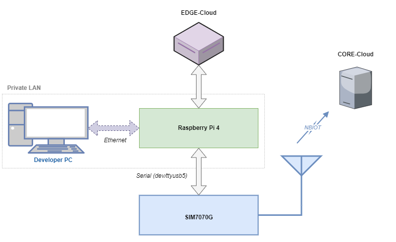
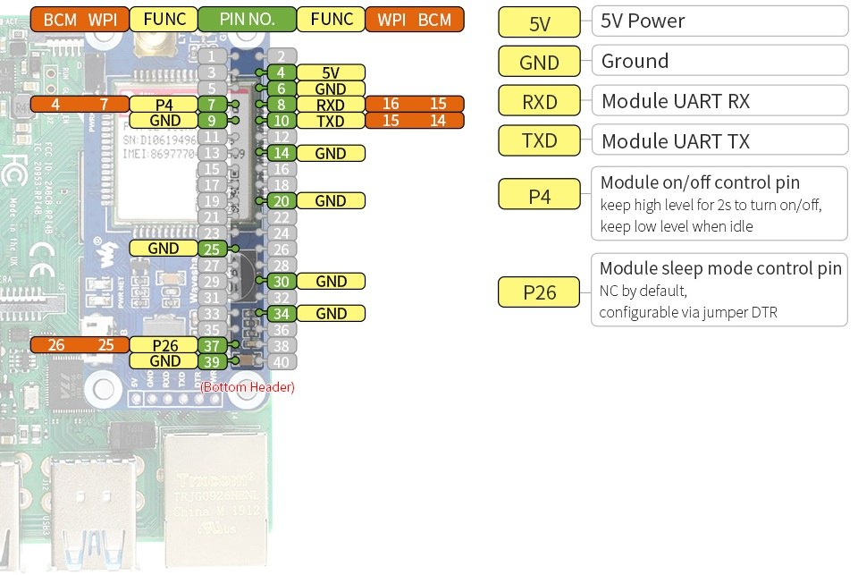
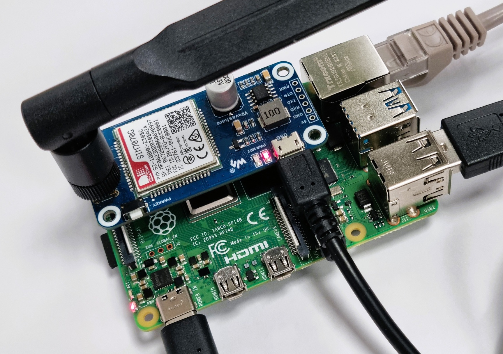
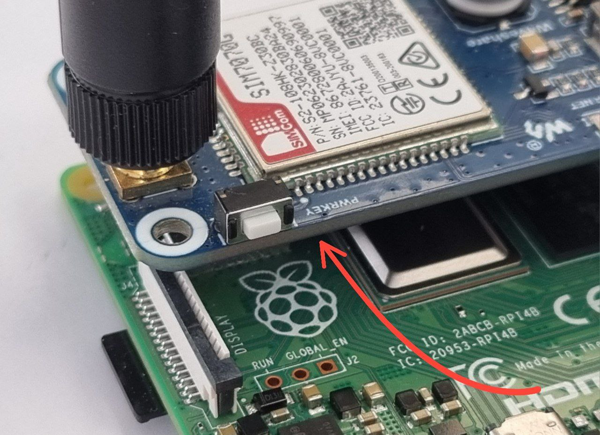
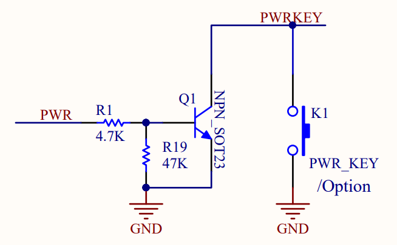

= Clever NB-IoT Gateway
MohammadMahdi Mohammadi
Mahdi.mohammadi@cortus.com
:doctype: book
:toc: left
:toclevels: 3
:icons: font
:source-highlighter: rouge
:sectnums:

[cols="1,2,1,1,3", options="header"]
|===
| Date | Author | Reviewed | Rev | Changes

| 2025-11-24
| MohammadMahdi Mohammadi
|
| Initial
| Initial version

|===

toc::[]

== Introduction

This document demonstrates the procedure for integrating SIM7070G modem with Raspberry Pi, with the goal of enabling the board to establish TCP and HTTP(S) communication.
The main aim of the project is to design a gateway that enables EDGE-Cloud to connect to CORE-Cloud in Clever environment. This connection has to be specifically established via NB-IoT protocol.

The following diagram shows this configuration:

.Raspberry Pi 4 Pinout Diagram

As demonstrated, the Raspberry Pi 4 is used as a development platform to configure and test the NB-IoT module. This board can later be replaced with any other board that supports USB serial communication and GPIO functionality.

In the Clever environment, the Cloud-Edge component is implemented on a Jetson development board. Since the modem is a standard USB device, it can theoretically be connected directly to the Jetson board while running the same software developed for the Raspberry Pi 4. Otherwise, the Raspberry Pi acts as an intermediary, receiving data from the Jetson board via an appropriate communication protocol and transmitting it over the NB-IoT network using the SIM7070G modem.

The following chapters describe the steps and considerations for implementing this setup:

* <<hardware_architecture, Hardware architecture>>
* <<software_overview, Software overview>>
* <<at_commands, AT commands reference>>

[[hardware_architecture]]
== Hardware architecture
=== Hardware requirements
This application is currently deployed using the Waveshare SIM7070G radio. To achieve this, the following hardware components are required:

* Raspberry Pi 4 Model B
* SIM7070G NB-IoT/Cat-M/GPRS/GNSS HAT for Raspberry Pi
* 1.8 V SIM card (NB-IoT supporting)
* MicroSD card
* LTE antenna
* USB-A to Micro-B cable
* USB-C Power Supply 5.1 V / 3 A (for Raspberry Pi 4 Model B)

As the SIM card suitable for NB‑IoT operation, a 1NCE IoT SIM has been used in this project. Specifically, the **IoT SIM Card Business** type is employed. It is obtained directly from the https://www.1nce.com[1NCE website]. NB‑IoT–compatible SIM cards are provided under the “IoT Lifetime Flat” plan. This type of SIM has been verified to operate reliably with the SIM7070G modem.

=== Hardware Setup
The hardware setup procedure is as follows:

* The microSD card has to be inserted into the Raspberry Pi 4 after flashing it with the required operating system.
The OS version can be checked by running the command:

[source,console]
----
uname -a
----

Which currently gives a response as:

[source,console]
----
Linux raspberrypi 6.12.34+rpt-rpi-v8 #1 SMP PREEMPT Debian 1:6.12.34-1+rpt1~bookworm (2025-06-26) aarch64 GNU/Linux
----

* The SIM card has to be inserted into the SIM slot on the SIM7070G module.
* The LTE antenna has to be connected to the SMA connector on the SIM7070G.
* Similar to any other HAT modules, the SIM7070G HAT has to be placed on top of the Raspberry Pi 4, with the 40-pin header fully seated. The hat pin config of the boards are given in the following figures.

[[fig:rpi4-pinout]]
.Raspberry Pi 4 Pinout Diagram
image::images/rpi4_pinout.png[width=75%,alt="Raspberry Pi 4 Pinout"]

[[fig:sim7070g-pinout]]
.SIM7070G HAT Pin Configuration

* The USB-A to Micro-B cable has to be connected between the Raspberry Pi and the SIM7070G module. This connection provides the dedicated USB serial interface used for modem communication.
* The USB-C power supply has to be connected to the Raspberry Pi 4 in order to power it on.

The described hardware setup is shown in <<fig:sim7070g-rpi4,Figure 4>>.

[[fig:sim7070g-rpi4]]
.SIM7070G and Raspberry Pi 4 hardware

[[power_toggling]]
=== Power supply and toggling

Connecting the SIM7070G modem via the HAT on the Raspberry Pi, **will porvide it the required power supply directly** from the board.
In this configuration, there is no need to provide an external power source for the modem, as the HAT ensures the correct voltage and current are supplied.

In order to power on or off, the SIM7070G modem is provided with a **power key** shown in the <<fig:sim7070g-pwrkey,Figure 5>>, which is available on the module. Pressing this key briefly pulls the PWRKEY pin low, initiating a power toggle. Users can operate the modem using this physical power key. Based on the *SIM7070G-HP Series Hardware Design V1.02* document:

* To **power on** the modem, the PWRKEY should be pressed for approximately **1 second**.
* To **power off** the modem, the key should be pressed for approximately **1.2 seconds**.

[[fig:sim7070g-pwrkey]]
.SIM7070G Power Key

In later sections, we describe how this same action can be performed programmatically using GPIO pins on the Raspberry Pi.
Specifically, **GPIO4 (physical pin 7)** on the Raspberry Pi is connected to the PWRKEY pin of the modem for power control. For reference, the pinout diagrams of the Raspberry Pi 4 and the SIM7070G modem are shown in <<fig:rpi4-pinout,Figure 2>> and <<fig:sim7070g-pinout,Figure 3>>, respectively.

NOTE: It should be noted that, contrary to the physical power key which is directly connected to the modem chip, the PWRKEY input on the HAT is affected by the presence of an NPN transistor.
As a result, the input is **inverted/contrary-driven**, meaning a low level on the Raspberry Pi pin produces a high level at the modem input, and vice versa, as illustrated in <<fig:powerkey-schematic,Figure 6>>.

[[fig:powerkey-schematic]]
.Power Key Driver Schematic

=== Serial connection check
After connecting the SIM7070G modem to the Raspberry Pi 4, it is important to verify that the module is detected via USB.
This can be done by running the following command in the terminal:

[source,console]
----
lsusb
----

A correctly connected SIM7070G modem should appear in the list similar to the following:

[source,console]
----
Bus 002 Device 001: ID 1d6b:0003 Linux Foundation 3.0 root hub
Bus 001 Device 101: ID 1e0e:9206 Qualcomm / Option SimTech SIM7080
Bus 001 Device 002: ID 2109:3431 VIA Labs, Inc. Hub
Bus 001 Device 001: ID 1d6b:0002 Linux Foundation 2.0 root hub
----

In this output, the line containing `Qualcomm / Option SimTech SIM7080` indicates that the SIM7070G modem has been recognized by the system and is available for further configuration and communication.
If the modem does not appear in the USB device list, a reboot or a check of the USB cable connection may be required.

NOTE: It should be noted that each time the USB port is reconnected, a reboot must be performed to ensure proper detection of the modem.

The next step is to ensure the modem is accessible via the serial interface.
On the Raspberry Pi, this requires two actions:

* **Enable the serial hardware interface** so that GPIO pins can be used for UART communication.
* **Disable the serial login shell** to prevent the Pi from using the serial port for console output, which would conflict with the modem.

These settings can be configured using the Raspberry Pi configuration tool:

[source,console]
----
sudo raspi-config
----

The relevant options are:

* 3 Interface Options → I6 Serial Port
  - Enable the serial hardware interface
  - Disable the login shell over serial

After these changes are applied and the Raspberry Pi is rebooted, the presence of the modem as a serial device must be confirmed using the following command:

[source,console]
----
ls /dev/ttyUSB*
----

An expected output would be:

[source,console]
----
/dev/ttyUSB0  /dev/ttyUSB1  /dev/ttyUSB2  /dev/ttyUSB3  /dev/ttyUSB4  /dev/ttyUSB5
----

If none of these device entries are listed, it is indicated that the modem is not being powered correctly or that it has been toggled off.
In such a case, the physical power button on the SIM7070G module must be held for approximately **2 seconds** so that the modem is ensured to be powered on, after which the USB device list can be checked again. The power toggling can be performed through the provided power control script, which is operated via GPIO4 of the Raspberry Pi. Further details are presented in later chapters.

According to the *SIM7070/SIM7080/SIM7090 Series Linux Application Note*, when the module is enumerated as a USB device, six USB serial interfaces are automatically created.
These interfaces are assigned fixed functions by the module firmware and are exposed to the operating system as follows:

[cols="1,3",options="header"]
|===
|Interface |Function
|0 |Diagnostic USB serial interface
|1 |GPS NMEA USB serial interface
|2 |AT command USB serial interface
|3 |QFLOG USB serial interface
|4 |DAM USB serial interface
|5 |Modem data USB serial interface
|===

This table explains why six USB serial device nodes appear when the command `ls /dev/ttyUSB*` is executed.
Each entry corresponds to one of the interfaces listed above, which are automatically created by the modem firmware and made available to the operating system.

Although the SIM7070G exposes six USB serial interfaces (0–5), the interface that is of interest for communication and configuration is Interface 5.
On the Raspberry Pi, this interface is enumerated as `/dev/ttyUSB5` and is the one that must be used for sending AT commands, performing TCP/HTTP communication, and configuring the modem.

Once the modem has been powered correctly and is listed among the USB serial devices, the developed software can be used to configure and test the modem.
Details on the configuration and testing procedures are provided in the Software chapter.

[[software_overview]]
== Software Overview

Once the SIM7070G modem has been powered correctly and is listed among the USB serial devices, the developed software can be used to configure and test the modem.
This chapter provides an overview of the software modules created for this purpose.

The software has been organized into several Python scripts, each performing a specific task:

[cols="1,3", options="header"]
|===
|File |Description

|modem_workflow.py
|Top-level module that executes the full workflow of the modem: power-up, initialization, TCP test, and HTTP/HTTPS GET and POST requests.

|modem_power.py
|Performs power toggling of the SIM7070G modem via GPIO4 (PWRKEY pin).

|modem_initializer.py
|Performs modular initialization and status checking of the SIM7070G modem.

|tcp_test.py
|Commands for testing TCP connection establishment.

|upload_ssl.py
|Uploads SSL certificates to the SIM7070G modem to enable secure HTTPS connections. (Certificate files are provided separately.)

|http_test.py
|Performs HTTP/HTTPS GET and POST requests using the SIM7070G modem. Supports multiple HTTPS servers with user selection.

|modem_logger.py
|Generates logs of modem commands and responses to enable debugging and monitoring.
|===

These modules together enable comprehensive testing and operation of the SIM7070G modem on the Raspberry Pi.
A Makefile is also provided to simplify execution of the Python modules.
Running the following command:

[source,console]
----
make help
----

will display all available targets, allowing the workflow, power toggle, initialization, TCP test, HTTP test, and cleanup to be executed easily from the terminal.

=== modem_workflow.py — Full Modem Workflow

The `modem_workflow.py` script is the top-level module that runs the full workflow of the SIM7070G modem.
It performs the following steps in order:

* Toggles modem power using `modem_power.py`
* Performs handshake and initialization using `modem_initializer.py`
* Runs TCP connection tests using `tcp_test.py`
* Performs HTTP/HTTPS tests using `http_test.py`
* Logs all actions using the helper module `modem_logger.py`

All primary scripts (except `upload_ssl.py`) can be executed on their own, but `modem_logger.py` is a helper and is not intended to be run separately.
This script provides a simple way to run all steps together in one execution.

The script also handles retries and power cycles if the modem does not respond initially.
It can be run directly or via the Makefile with the command:

[source,console]
----
make workflow
----

It must be mentioned that all AT commands and modem responses at each run will be recorded in a log file (`modem_log.log`) for later review.

=== modem_power.py — Modem Power Control

As introduced earlier in <<power_toggling, Section 2.3>>
, the SIM7070G modem is controlled through the PWRKEY pin, which on the HAT is driven through an NPN transistor shown in <<fig:powerkey-schematic,Figure 5>>. Because of this transistor stage, the signal is inverted: a *LOW* level from the Raspberry Pi produces a *HIGH* level at the modem input, and vice-versa. The `modem_power.py` script accounts for this behavior by driving GPIO4 (physical pin 7) in a way that correctly emulates the required power-button pulse.

This module toggles the modem power by applying a controlled pulse on GPIO4, mimicking the timing of a manual button press. The script also records all actions through the logging module. Before running it, the required GPIO library on Raspberry Pi OS must be installed:

[source,console]
----
sudo apt install python3-rpi.gpio
----

Once available, the script can be executed directly or through the Makefile using:

[source,console]
----
make power
----

This module ensures that the modem can be cleanly powered on or reset without manual interaction.

NOTE: *GPIO4 on the Raspberry Pi starts in a floating state after each reboot*, which can cause the SIM7070G modem to turn on or off unpredictably during system startup. For this reason, the `modem_power.py` script *should be executed at least once after every reboot* to stabilize the PWRKEY line. Doing so guarantees that the modem enters a known and controlled power state, regardless of its initial condition.

=== modem_initializer.py — Modem Initialization

After the modem is physically powered on, it still needs to be initialized as: radio mode may be wrong, APN may not match the NB-IoT provider, the SIM might not be ready yet, and network attachment may not be complete. The `modem_initializer.py` module brings the SIM7070G into a usable state for NB-IoT operation with the 1NCE SIM card.

This script performs the essential startup checks and configuration steps required before any kind of data exchange by performing the following tasks:

* Confirms that the modem is alive and responding.
* Checks that the SIM card is inserted and ready for operation.
* Assesses the signal strength and waits for a valid cellular connection.
* Verifies network attachment and configures the modem to use LTE-only mode with NB-IoT enabled.
* Checks the currently connected operator and provides human-readable network details.
* Ensures that the correct APN (Access Point Name) is configured for the 1NCE IoT SIM card (specifically, `iot.1nce.net`).
* Activates the PDP context to acquire an IP address, enabling data communication.

All activity is logged through the shared modem logger so that every step of the initialization can be reviewed later.

`modem_initializer.py` can run independently for troubleshooting, but during normal use it is called automatically by the main workflow script.

This script can be executed through the Makefile using:

[source,console]
----
make init
----

=== tcp_test.py — TCP Connectivity Test

The `tcp_test.py` module provides a workflow based on the SIMCOM TCP application note for testing TCP connectivity using the active PDP context established with the `modem_initializer.py` module. This script allows the user to verify that the modem can successfully open a TCP connection, send data, and receive responses, essential for the next step which is HTTP(S) testing.

Key features of this module include:

* Prompts the user to select a TCP test server, either a predefined public echo server "tcpbin.com" or a custom server specified by the user.
* Opens a TCP connection using the active PDP context obtained during modem initialization (when executed standalone, the user must provide a valid PDP context ID).
* Sends a small test payload and optionally waits to receive echoed data, to verify that the data path is operational.
* Handles connection retries and reports failures.
* Closes the TCP connection to release network resources.
* Logs modem commands and responses for debugging purposes.

This module is intended to confirm data connectivity, validating the modem, SIM card, APN configuration, and network attachment functionality.

=== http_test.py — HTTP/HTTPS Connectivity Test

The `http_test.py` module provides a workflow for testing HTTP and HTTPS connectivity on the SIM7070G modem. It allows users to validate that the modem can establish HTTP/HTTPS sessions, send GET and POST requests, and receive responses. This module is designed as a base for further integration into the Clever project environment.

Key features of this module include:

* Supports both HTTP and HTTPS requests, including user selection of test servers.
* Handles SSL configuration, certificate upload, and optional verification for HTTPS using `upload_ssl.py` module.
* Allows GET and POST requests with configurable headers and JSON payloads.
* Automatically parses and displays HTTP response codes and data lengths.
* Logs modem commands and responses for debugging purposes.
* Provides interactive prompts to guide the user through server selection and test execution.

Typical test workflow:

1. The user selects whether to perform HTTP GET, HTTPS GET, or HTTPS POST tests.
2. For HTTPS tests, the user chooses a server and the corresponding SSL certificate is uploaded if needed.
3. The module establishes a connection, configures headers, sends the request, and optionally reads the response.
4. After each request, the connection is closed to release network resources.

This module can be used to validate the modem, SIM card, APN configuration, and network attachment, and serves as a foundation for developing the main HTTP(S) communication workflow in the Clever project.

[[at_commands]]
== AT Commands Reference

This table lists the AT commands used in our Python scripts for the SIM7070G modem.
It is intended as a quick reference for debugging, testing, and verifying command responses.

NOTE: This reference covers only the commands we use in practice.
For the full specification of all supported AT commands, refer to the official
*SIM7070 / SIM7080 / SIM7090 Series AT Command Manual*
(Document Version 1.05, 2022-01-21, Released).

[cols="3,2,3", options="header"]
|===
| AT Commands | Description | Notes

| AT
| Basic modem responsiveness check
| Returns `OK` if modem is alive.
If it replies `ERROR` → serial port not in AT mode or modem stuck.
If no response → wrong port, wrong baudrate, or modem not powered.

| AT+CFUN?
| Query current functionality mode
| `1 = full`, `0 = minimum`, `4 = airplane`.
If `ERROR` → SIM not ready or modem busy switching modes.

| AT+CFUN=1
| Enable full functionality (RF on)
| Needed before network registration.
If `+CME ERROR` → operation not allowed (e.g., SIM locked, or ongoing mode change).

| AT+CPIN?
| Check SIM state
| `READY` means SIM unlocked.
`+CPIN: SIM PIN` → needs PIN.
`+CME ERROR` → SIM missing or unreadable.

| AT+CSQ
| Signal quality
| Returns `+CSQ: <rssi>,<ber>` → dBm = `-113 + rssi*2`.
`99,99` = no signal, no service, or RF disabled.

| AT+CGATT?
| Check packet-service attach status
| `1 = attached`, `0 = detached`.
If remains `0` → APN/TAC issue, SIM data disabled, or poor coverage.
If `ERROR` → no SIM or modem not functional.

| AT+CNMP=?
| Query supported RAT modes
| Lists all RAT modes device supports.
If `ERROR` → command not supported on this firmware.

| AT+CMNB=?
| Query LTE/NB-IoT mode support
| Shows available LTE/NB configurations.
If `ERROR` → module variant doesn’t support NB-IoT.

| AT+CFUN=0
| Set minimum functionality
| Disables RF.
If commands after this give `ERROR` → because RF stack is offline.

| AT+CNMP=38
| Switch RAT to LTE only
| May take several seconds.
If `+CME ERROR: 3` → operation not allowed (try CFUN=0 first).
If stuck, toggle CFUN after setting.

| AT+CMNB=2
| Configure LTE mode to NB-IoT
| Must be followed by `AT+CFUN=1` to apply.
`ERROR` → wrong order or RAT locking required.

| AT+CFUN=1
| Restore full functionality after RAT change
| If `ERROR` → modem is still transitioning or SIM error.

| AT+CPSI?
| Get serving cell info
| If empty or `NO SERVICE` → not registered.
`ERROR` → RF disabled or RAT misconfigured.

| AT+COPS?
| Operator registration status
| Shows selected operator. May take several seconds.
If stuck on manual mode → deregister and retry.
`ERROR` → SIM issues or RAT mismatch.

| AT+CGNAPN
| Query network-provided APN
| If blank → SIM does not provide APN; user must set it manually.
If `ERROR` → unsupported or no network.

| AT+CNCFG=<cid>,1,"iot.1nce.net"
| Configure PDP context
| If `ERROR` → invalid CID or syntax.
`+CME ERROR: 50` → not allowed (CFUN must be 1).
`+CME ERROR: 30` → no network.

| AT+CNACT?
| Check PDP activation state
| `1 = active`, `0 = inactive`.
If always `0` → APN wrong, attach failure, or weak coverage.
`ERROR` → context misconfigured.

| AT+CNACT=<cid>,1
| Activate PDP context
| If `+CNACT: <cid>,0` → activation failed (usually APN or attach issue).
`ERROR` → modem not attached (`CGATT=0`) or wrong RAT.

| AT+CASSLCFG=<conn_id>,"SSL",0
| Disables SSL for a TCP connection
| Must be executed before opening a TCP socket.
If it returns `ERROR` → SSL profile not found or connection ID invalid.

| AT+CAOPEN=<conn_id>,<cid>,"TCP","<ip>",<port>
| Opens a TCP connection using a PDP context
| Successful reply includes: `+CAOPEN: <conn_id>,0`
If it returns:
• `+CAOPEN: <conn_id>,1` → Failed (network issue, unreachable server)
• `ERROR` → AT syntax error or PDP context invalid
• `+CME ERROR: <code>` → SIM/network/config issue.

| AT+CACLOSE=<conn_id>
| Closes an active TCP connection
| Returns `OK` on success.
If closed already → may return `+CME ERROR: operation not allowed`.

| AT+CASTATE?
| Queries the state of all TCP connections
| Look for: `+CASTATE: <conn_id>,1` (active) or `0` (inactive).
If `ERROR` appears → PDP not active or invalid state.

| AT+CASEND=<conn_id>,<len>
| Prepares modem to send TCP payload
| Modem replies with `>` prompt.
If you don’t get `>` → connection not active or modem busy.
If `ERROR` → invalid length or socket not open.

| AT+CARECV=<conn_id>,<max_len>
| Reads received TCP data from the session
| Expected reply: `+CARECV: <conn_id>,<data>`
If timeout occurs → no data available.
If `ERROR` → invalid connection ID or buffer empty.

| AT+SHDISC
| Close any active HTTP/HTTPS session
| Always run before opening a new session to avoid leftover state.
  If it returns ERROR: session may already be closed — safe to ignore.

| AT+SHCONF="URL","<url>"
| Set target server base URL
| Must be called before SHCONN.
  ERROR indicates invalid URL or modem not in correct state.

| AT+SHCONF="BODYLEN",<len>
| Set maximum expected HTTP body length
| Should be large enough for server responses.
  ERROR → value out of allowed range.

| AT+SHCONF="HEADERLEN",<len>
| Set maximum expected HTTP header size
| Required to prevent truncated headers.
  ERROR → header length too large.

| AT+SHCONN
| Open HTTP/HTTPS session
| Returns OK even if connection fails; real state must be checked with SHSTATE?.
  If repeatedly failing, ERROR may indicate network issues or APN not configured.

| AT+SHSTATE?
| Query current session state
| “+SHSTATE: 1” means connected.
  ERROR → session not initialized or modem busy.

| AT+SHCHEAD
| Clear all previously stored HTTP headers
| Required before setting fresh headers.
  ERROR → session not active yet; safe after SHCONN.

| AT+SHAHEAD="key","value"
| Add a single HTTP header
| Must run after SHCHEAD.
  ERROR → header too long or invalid quoting.

| AT+SHREQ="<path>",1
| Perform HTTP/HTTPS GET request
| Returns “+SHREQ: <code>,<len>”.
  ERROR → path invalid or session not opened.
  If HTTP code is 400/500-series, it’s a server-side failure, not modem error.

| AT+SHREQ="<path>",3
| Perform HTTP/HTTPS POST request
| Same response format as GET.
  If posting large bodies, ensure SHBOD succeeded first.
  ERROR → session closed or body not written.

| AT+SHREAD=<offset>,<length>
| Read HTTP response body from modem buffer
| Must use length returned by SHREQ.
  ERROR → offset/length out of range or no body available.

| AT+SHBOD=<length>,<timeout>
| Prepare modem to receive POST body
| After OK, modem expects raw body text.
  ERROR → body length too large or session not active.

| AT+CSSLCFG="sslversion",1,3
| Configure SSL version (1 = profile, 3 = TLS 1.2)
| Needed for HTTPS connections.
  ERROR → SSL not supported or wrong profile number.

| AT+SHSSL=1,""
| Enable SSL for session (profile 1)
| Empty quotes skip certificate validation.
  ERROR → certificate missing or invalid profile.

| AT+CFSINIT
| Initialize modem file system (FS)
| Must be called before any file operations.
  ERROR → FS not available, modem busy, or previous session not closed.

| AT+CFSTERM
| Terminate/close file system
| Used to cleanly close FS or reset state.
  If returns ERROR, FS was likely already closed — generally safe to ignore.

| AT+CFSWFILE=3,"<name>",0,<size>,<timeout>
| Prepare modem to receive a file via stream upload
| Modem must reply with `DOWNLOAD` prompt.
  ERROR → invalid filename, size too large, or FS not initialized.
  If no DOWNLOAD appears: abort upload, FS likely unstable.

| AT+CSSLCFG="convert",2,"<name>"
| Convert uploaded certificate into internal SIM7070 SSL storage
| Must be run after file upload.
  OK → conversion successful and certificate ready for HTTPS.
  ERROR → certificate already exists OR file invalid format.
  Modem may require deletion via:
  `AT+CSSLCFG="del",2,"<name>"`

| AT+CSSLCFG="del",2,"<name>"
| Delete certificate from SSL storage
| Not executed directly in script, but referenced in warning.
  Necessary when conversion fails due to existing certificate.

|===
